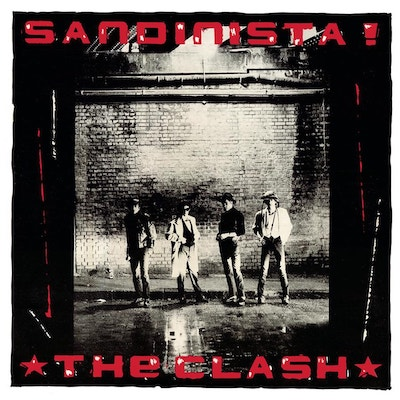

up:: [Art and Music MOC](Art%20and%20Music%20MOC)
tags:: #randomMemory #writing 

# Sandinista!
### Listening to Sandinista by the Clash, I was instantly transported to the year. I turned 12. 

We were living in Queens, New York, and spending a lot of time looking for an apartment and when we found an apartment, I spent a lot of time avoiding getting to know classmates that I did not like, and I knew would not like me if we got to know each other. 

That was the school year I stayed home, almost the entire year showing up for finals. Because the schools were not great to say the least, I aced the finals, to the teacher's pleasant surprise.

> **sandinista!** is the fourth studio album by the English punk rock band the Clash. It was released on 12 December 1980 as a triple album containing 36 tracks, with 6 songs on each side. It crosses various genres including funk, reggae, jazz, gospel, rockabilly, folk, dub, rhythm and blues, calypso, disco, and rap. For the first time, the band's traditional songwriting credits of Strummer and Jones were replaced by a generic credit to the Clash.  The band agreed to a decrease in album royalties in order to release the 3-LP at a low price.The title refers to the Sandinistas in Nicaragua, and its catalogue number, 'FSLN1', refers to the abbreviation of the party's Spanish name, Frente Sandinista de Liberación Nacional.Sandinista! was mostly well received, however, there was criticism towards the large size of the triple album. Unlike the both universally acclaimed predecessor and successor albums, Sandinista! is the lowest charting album for the Clash in their native United Kingdom. However, Sandinista! was influential in the punk rock movement with its experimental sound and was voted best album of the year in the Pazz & Jop critics poll in The Village Voice. In 2020 it was ranked number 323 on the Rolling Stone list of "The 500 Greatest Albums of All Time" and Slant Magazine listed the album at number 85 on its "Best Albums of the 1980s" list.
>
> [Wikipedia](https://en.wikipedia.org/wiki/Sandinista!)
